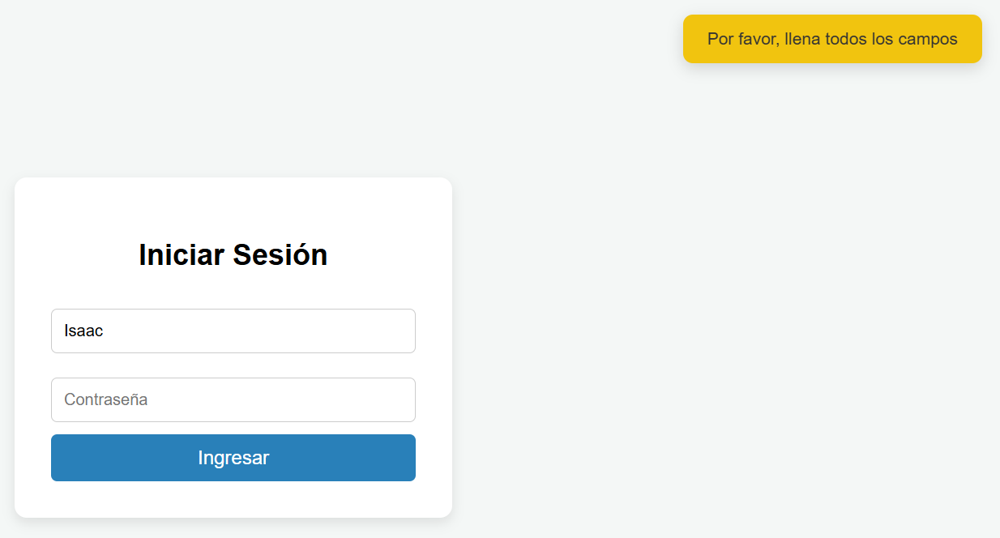
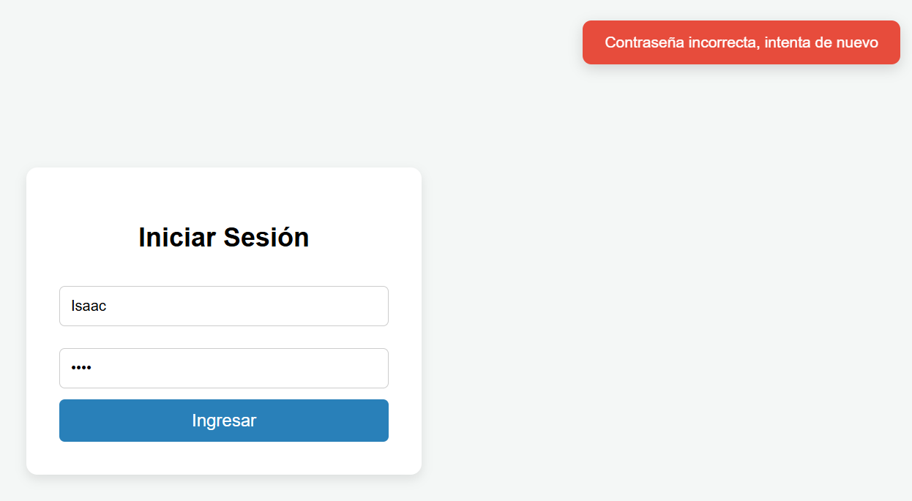
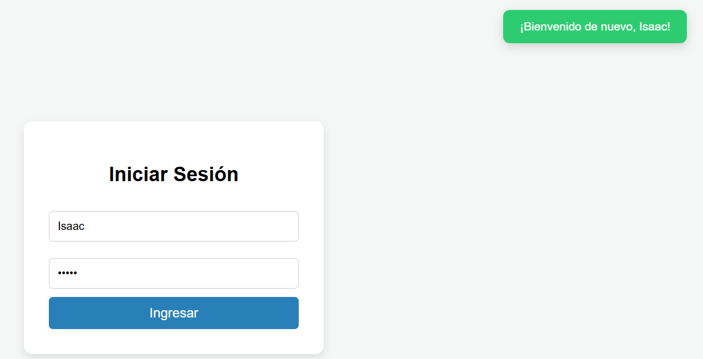

# Toast JS - Librería de Notificaciones Reutilizables

## Portada
* **Autor:** Isaac Emmanuel Diaz Martinez
* **Nombre del componente:** Toast JS
* **Materia:** Programación web

## ¿Qué problema resuelve?
Cuando estás haciendo una página web, las alertas normales que trae el navegador aveces no nos pueden gustar,
bloquean toda la pantalla y el usuario tiene que darle aceptar a fuerzas para seguir navegando. 
Este componente resuelve exactamente eso: crea notificaciones flotantes modernas y bonitas que aparecen en la esquina sin estorbar, 
le avisan al usuario si algo salió bien, mal o si le falta llenar un dato, y se quitan solas después de unos segundos.

## Estructura del proyecto
```text
Actividad3/
│
├── README.md
├── index.html
│
├── css/
│   ├── estilos.css
│   └── style.css
│
├── js/
│   └── toast.js
│
└── img/
    └── Capturas de pantalla
```

## Instalación
Para utilizar este componente en cualquier proyecto web, solo necesitas enlazar los archivos de la librería e incluirlos en tu documento HTML.

**Incluir el css**
* <link rel="stylesheet" href="css/style.css">

**Incluir el JavaScript**
* <script src="js/toast.js"></script>

## Uso y ejemplos de código

### 1. Notificación de éxito al iniciar sesión
```javascript
mostrarToast(
    "¡Bienvenido de nuevo, usuario!",
    "exito"
);
```

### 2. Notificación de error al iniciar sesión
```javascript
mostrarToast(
    "Contraseña incorrecta, intenta de nuevo.",
    "error"
);
```

### 3. Notificación de advertencia
```javascript
mostrarToast(
    "Por favor, llena todos los campos.",
    "advertencia"
);
```

### 3. Ejemplo integrado en un login
```javascript
<script src="js/toast.js"></script>
    <script>
        function probarLogin() {
            const user = document.getElementById('usuario').value;
            const pass = document.getElementById('password').value;
            
            // 1. Si falta algún campo
            if (user === "" || pass === "") {
                mostrarToast('Por favor, llena todos los campos', 'advertencia');
            } 
            // 2. Si la contraseña es incorrecta
            else if (pass !== "12345") {
                mostrarToast('Contraseña incorrecta, intenta de nuevo', 'error');
            } 
            // 3. Si todo está bien
            else {
                mostrarToast('¡Bienvenido de nuevo, ' + user + '!', 'exito');
            }
        }
    </script>
</body>
```

## Capturas de pantalla
### Advertencia


### Error


### Exito



